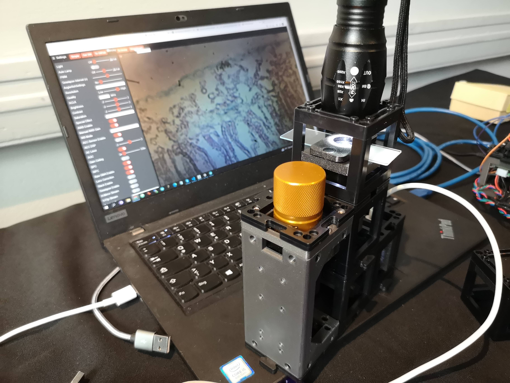

# openUC2 *XIAO Camera Module*
---

This repository will help you to build and setup *a SEED XIAO camera module based on the ESP32S3 camera module featuring an OV2640 camera sensor*.

Curious to see what this looks like? Keep scrolling!

***Features:***
* adds a digital camera to the UC2 System
* enables sharing your results easily

## In-Action

By adding a microscope objective lens, a folding mirror and a torch, a simple compound microscope can be created:

# Software

The source code for the camera can be found here: https://github.com/beniroquai/SeeedStudio-XIAO-ESP32S3-Sense-camera

The online flashing tool to flash the software can be found here: https://matchboxscope.github.io/firmware/FLASH.html

Additional information about the camera module can be found here: https://wiki.seeedstudio.com/xiao_esp32s3_getting_started

# Hardware

Below we describe how the device can be build and assembled in order to replicate the whole system as shown in the rendering above. One needs additional parts that can be found in the core [openUC2 repository](https://github.com/bionanoimaging/UC2-GIT).

## Bill of material

Below you will find all components necessary to build this device

### 3D printing files

All these files need to be printed. We used a Prusa i3 MK3 using PLA Prusament (Galaxy Black) at layer height 0.3 mm and infill 20%.

|  Type | Details  |  Price | Link  |
|---|---|---|---|
| Base | Base Holder for the camera |  1,00 € | [Part.stl](./STL/)  |
| Plate | Base Plate for the camera |  1,00 € | [Part.stl](./STL/)  |

### Additional parts

This is used in the current version of the setup

|  Type | Details  |  Price | Link  |
|---|---|---|---|
| Xiao Sense | Represents the digital camera |  15 € | [Xiao]()  |
| Screw | Din912 |  1 € | [Xiao]()  |

### Design files

The original design files are in the [INVENTOR](./INVENTOR) folder. *FOR ANOTHER FORMAT, GET YOUR OWN FOLDER.*

### Electronics

*COMING SOON*

### Assembly of the DEVICE

***1.*** *These are the parts needed for the ESP32-based camera. Remove the camera lens from the ESP32*

***2.*** *These are the parts needed for the ESP32-based camera*

## Showcase

./IMAGES/VID_20230523_103525~2.mp4.mp4)

## Get Involved

This project is open so that anyone can get involved. You don't even have to learn CAD designing or programming. Find ways you can contribute in  [CONTRIBUTING](https://github.com/openUC2/UC2-GIT/blob/master/CONTRIBUTING.md)

## Seeed Microscope

This mircoscope is based on the Seeed Studio Xiao Sense Camera (ESP32S3)

### Bill of Material

| Object Number | Description | File Name | Amount | Link | Source | Estimated Cost |
|---|---|---|---|---|---|---|
| 1 | Injection Molded Cube | 10_Cube_1x1_IM.ipt | 10 | [Link](www.openUC2.com) | openUC2 - Injection Molded | $5.00 |
| 2 | Astromedia Front Surface Mirror 40x30mmx1mm | 00_Astromedia_FronSurfaceMirror_40x30mmx1mm.ipt | 1 | [Astromedia](https://astromedia.de/Vorderflaechen-Glasspiegel-40x30mm) | Extern | $4.90 |
| 3 | Mirror Holder Cube Insert with UC2 Logo | 20_Cube_Insert_Mirror_Holder_wLogo_Astromedia_30x40x1_v3.ipt | 1 | [Link](www.openUC2.com) | openUC2 - Printed | $2.00 |
| 4 | Double-sided Adhesive 3M Scotch Acrylic | 00_Doublesided_Adhesive_3M_scotch_acrylic_20x3m_4218p.ipt | 1 | [Link]([www.openUC2.com](https://www.amazon.de/doppelseitiges-Klebeband-Klebestreifen-Klebepads-Klebepunkte/dp/B00SFSRN0E/ref=asc_df_B00SFSRN0E/?tag=googshopde-21&linkCode=df0&hvadid=257095804762&hvpos=&hvnetw=g&hvrand=15958409313771828159&hvpone=&hvptwo=&hvqmt=&hvdev=c&hvdvcmdl=&hvlocint=&hvlocphy=9042960&hvtargid=pla-428193255014&psc=1&th=1&psc=1 or https://www.3m.com/3M/en_US/p/d/b40065650/) | Extern | $0.20 |
| 5 | Flashlight FX Light  | 00_flashlight_FX_light_FC4_Pollin.ipt | 1 | [Link](https://de.aliexpress.com/item/1005005058046686.html) | Extern | $6.80 |
| 6 | Mount for Universal Linear Stage | 30_Linear_Stage_NEMA11_China_base_universal_v3.ipt | 1 | [Link](www.openUC2.com) | openUC2 - Printed | $8.00 |
| 7 | Bayonet Mount for RMS Objective  | 30_Linear_
Stage_NEMA11_baseholder_bayonetmount_objective_v0.ipt | 1 | [Link](www.openUC2.com) | openUC2 - Printed | $0.50 |
| 8 | Lid for Linear stage | 30_Linear_Stage_NEMA11_China_lid_universal_extender_v2.ipt | 1 | [Link](www.openUC2.com) | openUC2 - Printed | $2.00 |
| 9 | Objective Moun Arm | 30_Linear_Stage_NEMA11_arm_bayonetmount_femalemale.ipt | 1 | [Link](www.openUC2.com) | openUC2 - Printed | $2.00 |
| 10 | Manual Linear Stage 50mm, 1mm pitch | 00_Linear_Stage_Manual_50mm_china.iam | 1 |[Aliexpress](https://de.aliexpress.com/item/4000001267558.html) | Extern | $50.00 |
| 11 | Injection Molded Base Puzzle v3 | 10_Base_puzzle_v3.ipt | 10 | [Link](www.openUC2.com) | openUC2 - Injection Molded | $0.50 |
| 12 | Seeeduino Xiao Sense | 00_Seeeduino Xiao.ipt | 1 | [Link](https://www.seeedstudio.com/Seeed-XIAO-BLE-Sense-nRF52840-p-5253.html) | Extern | $16.00 |
| 13 | Cube Insert for SEEED Xiao Sense Camera | 20_Cube_Insert_SEEED_Xiao_Sense_Camera.ipt | 1 | [Link](www.openUC2.com) | openUC2 - Printed | $5.00 |
| 14 | Backplate for Cube Insert of SEEED Xiao Sense Camera | 20_Cube_Insert_SEEED_Xiao_Sense_Camera_backplate.ipt | 1 | [Link](www.openUC2.com) | openUC2 - Printed | $1.20 |
| 15 | Microscope Objective 10x, NA0.25 | 00_Microscope_objective_10x.ipt | 1 | [Aliexpress](https://de.aliexpress.com/item/4000427537503.html?pdp_npi=2%40dis%21EUR%2114%2C12%E2%82%AC%215%2C57%E2%82%AC%21%21%21%21%21%40211b5e2216903901674472196ee0f0%2110000001769780340%21btf&_t=pvid%3Af0c76811-a712-4c46-9a7b-446ee7fefb58&spm=a2g0o.ppclist.product.mainProduct&gatewayAdapt=glo2deu) | Extern | $20.00 |
| 16 | Sample Holder Cube Insert v3 | 20_Cube_insert_Sample_holder_v3.ipt | 1 | [Link](www.openUC2.com)) | openUC2 - Printed | $1.00 |
| 17 | NeoDym Magnet 8x3mm | 00_NeoDymMagnet_8x3mm.ipt | 4 | [Link](https://chinese.alibaba.com/product-detail/Round-Magnet-Neodymium-8x1mm-8x2mm-8x3mm-1600371779452.html) | Extern | $0.05  |
| 18 | Sample Clamp Cube Insert | 20_Cube_Insert_Sample_clamp.ipt | 1 | [Link]([#](https://ww | openUC2 - Printed |$0.18  |
| 19 | Microscope Slide | 00_Microscope_Slide.ipt | 1 | [Link](https://www.alibaba.com/product-detail/Fixed-100pcs-of-box-set-biology_1600205931692.html) | Extern | $0.04|
| 20 | Screw DIN914, M3x5mm, Flat head, 	 |  | 3 | [Link](https://www.rst-versand.de/Gewindestift-Innensechskant-M35-DIN-914-ISO-4027_1) | Extern | $0.50 |
| 21 | Screw, M3 x 60 mm (A2 - DIN912) |  | 2 | [Link](https://www.rst-versand.de/Zylinderschraube-Innensechskant-M3-x-60-mm-A2-DIN912_1) | Extern | $0.50 |
| 22 | Screw, M3 x 12 mm (A2 - DIN912) | | 8 | [Link](https://www.rst-versand.de/Zylinderschraube-Innensechskant-M3-x-12-mm-A2-DIN912_1) | Extern | $0.50 |

### 3D CAD Files

All files that have to be printed can be found in [STL/Seeed/STL](./STL/Seeed/STL).

### Additional technical details

TBA

## License and Collaboration

This project is open-source and is released under the CERN open hardware license. Our aim is to make the kits commercially available.
We encourage everyone who is using our Toolbox to share their results and ideas, so that the Toolbox keeps improving. It should serve as a easy-to-use and easy-to-access general purpose building block solution for the area of STEAM education. All the design files are generally for free, but we would like to hear from you how is it going.

You're free to fork the project and enhance it. If you have any suggestions to improve it or add any additional functions make a pull-request or file an issue.

Please find the type of licenses [here](https://github.com/openUC2/UC2-GIT/blob/master/License.md)

REMARK: All files have been designed using Autodesk Inventor 2019 (EDUCATION)

## Collaborating
If you find this project useful, please like this repository, follow us on Twitter and cite the webpage! :-)
